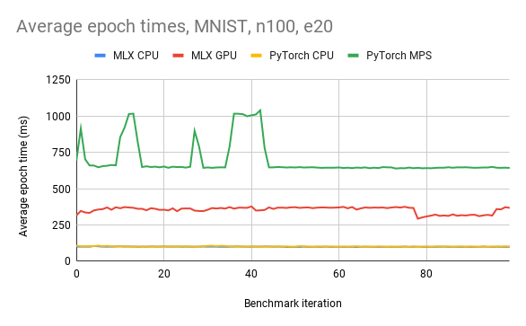
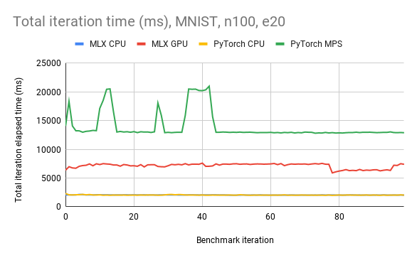
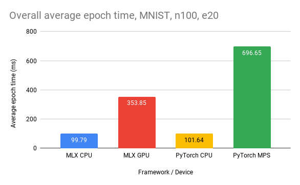
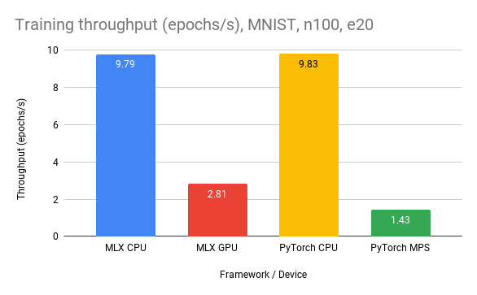
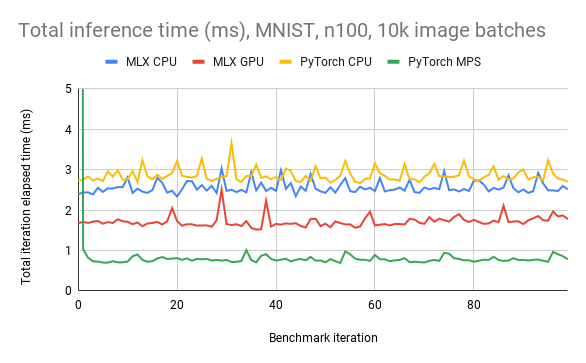
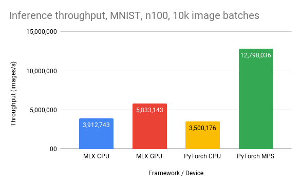

# MLX and PyTorch, Benchmarked
**Author: Richik Sinha Choudhury <sinhachoudhu (at) wisc (dot) edu>**

**Date: 11th December 2023**

Apple recently released the [MLX framework](https://github.com/ml-explore/mlx),
a Python array and machine learning framework designed for Apple Silicon Macs (M1, M2, etc).

Apple touts that MLX takes advantage of Apple Silicon's [unified memory architecture](https://en.wikipedia.org/wiki/Graphics_processing_unit#Integrated_graphics),
enabling training and inference on CPU and GPU without incurring the cost of copying data.
This may make a larger difference with smaller models, where the constant-time overhead of
data copying may negate any parameter count-dependent gains in computation.

To verify this, I benchmarked MLX performance for a small model on CPU and GPU against [PyTorch](https://pytorch.org/), the most popular framework in the machine learning community.

These benchmarks are based on sample code released by Apple at [ml-explore/mlx-examples](https://github.com/ml-explore/mlx-examples).

## Running benchmarks

The benchmarks were developed and run with Python 3.10.3.

Ensure you have the required packages installed:
```sh
python -m pip install -r requirements.txt
```

To benchmark the [MNIST](mnist) example:

```sh
cd mnist

# For MLX
python benchmark_mlx.py -n <number of training runs> -e <number of epochs> [--gpu]

# For PyTorch
python benchmark_torch.py -n <number of training runs> -e <number of epochs> [--gpu]
```
Where `<number of training runs>` indicates the number of times to train a model from scratch,
and `<number of epochs>` indicates the number of training epochs per training run.
Therefore, the total number of training epochs is `n * e`.

<!-- Similar benchmark scripts are available for the [Transformer language model](transformer_lm) example. Please note they must be ran with `--eval` to benchmark inference. -->


This will produce a CSV file, e.g. `mlx-train-cpu-n100-e10.csv`, with `n` rows, one per training run.

The first `e` columns are the elapsed training time for epochs 0 through `e`.
The second to last column indicates the mean epoch time. The final column is
the total training time for that training run, including model loading.

## Results

Benchmarks were run on a 13" MacBook Pro (M1, 2020) with 16 GB of RAM. The system load was controlled, with only the benchmark script, Visual Studio Code, Activity Monitor, Google Chrome (<3 tabs), and standard background processes running.

MLX benchmarks were evaluated on the `gpu` and `cpu` devices, and PyTorch benchmarks were evaluated on the `cpu` and `mps` (Metal Performance Shaders, GPU) backends.

In addition to the CSV files included under `results/` directories in `mnist` and `transformer_lm`, a [Google Sheet](https://docs.google.com/spreadsheets/d/17Rid-DTGz_0k8TLOxUJ2Y3_7QKAOVB2MlagqA5BjNro/edit?usp=sharing) is available with all the data and relevant summaries and charts.

### MNIST
Code: [mnist](mnist)

Evaluated the training and inference performance of a simple MLP model trained on the MNIST dataset with 2 hidden layers of 32 neurons and the ReLU activation function. Each training epoch processed all 60,000 training images with a batch size of 256.

> **ℹ️ Note:** the PyTorch sample code has been modified to move each batch to the target device for every batch iteration,
> to simulate using a `DataLoader`. The original sample code moved the entire train and test dataset to the target device at the beginning, which is not possible using `Dataset` and `DataLoader` in a typical PyTorch scenario.


- Number of train/test iterations (`n`): 100
- Number of epochs per iteration  (`e`): 20

#### CPU/GPU Usage

In addition to measuring throughput and performance, I've also included CPU and GPU usage statistics to compare the compute efficiency of the frameworks.

| Statistic           | MLX CPU | MLX GPU      | PyTorch CPU | PyTorch GPU  |
| ------------------- | ------- | ------------ | ----------- | ------------ |
| Sustained CPU Usage | 101%    | 88% (50-95%) | 100%        | 78% (77-90%) |
| CPU Time            | 3:27.31 | 9:59.66      | 3:23.37     | 18:45:36     |
| Sustained GPU Usage | 0%      | 98%          | 0%          | 73% (71-75%) |
| GPU Time            | 0.0     | 8:09.73      | 0.0         | 7:22.34      |


#### Charts
**Training:**









**Inference:**



> :warning: Note the outlier in the very first inference iteration for PyTorch MPS.
I've excluded this data point when calculating throughput.



### Conclusions

Training performance with both MLX and PyTorch on the M1 CPU are virtually indistinguishable, and MLX provides no gains when training on the CPU. Throughput is near identical and epoch times are consistent and stable on both.

Training the model on the M1's GPU with severely limits throughput on both PyTorch and MLX compared to the CPU, most likely due to the M1's small GPU. However, with data movement taken into account, MLX does provide a significant speed-up compared to PyTorch, with nearly double the training throughput. Keep in mind that individual batches of training data were moved to the device during the training loop, in order to simulate a `DataLoader` in PyTorch.

PyTorch GPU spent significantly more time on the CPU while training and had lower GPU utilization, meaning it could not make full use of the M1's GPU, likely due to data movement overhead or lack of optimization. It also had more spikes in epoch time, perhaps due to PyTorch performing some form of garbage collection on previously moved minibatches of data.

When it comes to inference, MLX makes modest gains over PyTorch on the CPU. However, with inference, the M1 GPU is able to deliver noticeable performance gains over the CPU. With MLX, inference throughput was ~1.5x the CPU, but PyTorch on the GPU blew both MLX GPU and PyTorch CPU out of the water, with 3.6x the throughput of PyTorch CPU and 2.1x the throughput of MLX GPU. However, this does not take into account data movement, as the test dataset is not batched for inference and inference is performed on all 10k images at once. Therefore, the test dataset is moved once before the inference loop.

#### Potential improvements

It would be interesting to see whether results would vary on the larger M-series chips, such as the M1/M2 Max and Ultra with large GPUs. A larger GPU may improve training performance compared to the CPU, as training would no longer be GPU constrained. In addition, the benchmarks could be expanded to other models and model architectures, such as the [Transformer language model](transformer_lm) example. Finally, you could add batched data movement to PyTorch inference, and also compare ahead-of-time data movement to batched data movement to compare PyTorch and MLX like-for-like on raw throughput performance.
